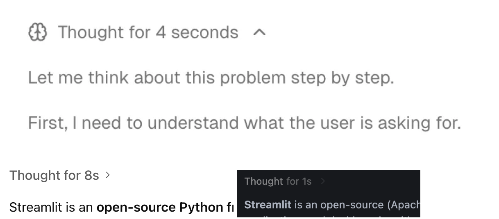
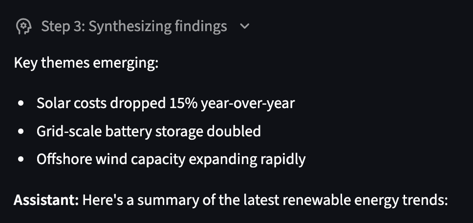

# Compact style for `st.expander` and `st.status`

## Summary

Add support for a compact, borderless style to `st.expander` and `st.status` via a new
`type: Literal["default", "compact"] = "default"` parameter. The compact style removes the
border and background, rendering the toggle as minimal inline text—ideal for displaying
AI reasoning, thoughts, or collapsible metadata without visual clutter.



## Problem

Users building AI-powered applications need a way to display collapsible "thinking" or
reasoning content in a compact, unobtrusive style. The current `st.expander` and `st.status`
components render with a prominent border and background that works well for section grouping
but feels too heavy for inline reasoning disclosure.

**User request:**

- [#13246](https://github.com/streamlit/streamlit/issues/13246) — Provide a compact style for
  `st.expander` and `st.status` (5+ upvotes)

**Use cases:**

- **AI reasoning disclosure**: Show model "thinking" steps that can be expanded on demand
  (like ChatGPT, Claude, and Gemini's reasoning UI)
- **Streaming thought indicators**: Display "Thought for X seconds" toggles during agent runs
- **Lightweight metadata toggles**: Show optional details without breaking content flow
- **Debug information**: Collapsible technical details that don't need visual prominence

**Current behavior:**

Both `st.expander` and `st.status` render with a full border and background:

```python
with st.expander("Thought for 4 seconds"):
    st.write("Let me think about this problem step by step...")
```

This creates a boxed container that dominates the visual hierarchy. Users want an alternative
that blends into the content flow—just a small toggle with text.

**Industry pattern:**

This compact toggle pattern is common across major AI interfaces:

| Platform        | Implementation                                       |
| --------------- | ---------------------------------------------------- |
| ChatGPT         | "Thought for X seconds" collapsible reasoning        |
| Claude          | Expandable thinking blocks in extended thinking mode |
| Gemini          | Collapsible reasoning steps                          |
| Vercel AI SDK   | `<Reasoning>` component with minimal chrome          |

## Proposal

### API

Add a `type` parameter to both `st.expander` and `st.status`:

```python
st.expander(
    label: str,
    expanded: bool = False,
    *,
    type: Literal["default", "compact"] = "default",  # NEW
    key: Key | None = None,
    icon: str | None = None,
    width: WidthWithoutContent = "stretch",
    on_change: Literal["ignore", "rerun"] = "ignore",
)

st.status(
    label: str,
    *,
    type: Literal["default", "compact"] = "default",  # NEW
    expanded: bool = False,
    state: Literal["running", "complete", "error"] = "running",
    width: WidthWithoutContent = "stretch",
)
```

### Parameter

| Parameter | Type                             | Default    | Description                                                                                                                       |
| --------- | -------------------------------- | ---------- | --------------------------------------------------------------------------------------------------------------------------------- |
| `type`    | `Literal["default", "compact"]`   | `"default"` | The visual style of the component. `"default"` displays with border and background. `"compact"` renders as a minimal inline toggle. |

### Behavior

**`type="default"` (default):**

- Current behavior: Full border, background color on hover, rounded corners
- The expander/status appears as a distinct visual container
- Best for: Section grouping, prominent collapsible content, form sections

**`type="compact"`:**

- Compact toggle: Only the label and chevron/icon are visible
- No border, no background (except subtle hover highlight on the toggle itself)
- Toggle text uses secondary color to indicate interactivity
- Best for: Inline reasoning disclosure, lightweight metadata, debug info

### Design

**Default style (`type="default"`):**

```
┌─────────────────────────────────────────┐
│ ▸ Thought for 4 seconds                 │
└─────────────────────────────────────────┘
```

**Compact style (`type="compact"`):**

```
Thought for 4 seconds ›
```

When expanded with `type="compact"`:

```
Thought for 4 seconds ˅

Let me think about this problem step by step.

First, I need to understand what the user is asking for...
```

**UI design mockup (expanded state):**



**Visual details for compact style:**

- **Trailing chevron**: Chevron appears after the label (not before), similar to navigation
  menu group headers. Points right (`›`) when collapsed, down (`˅`) when expanded.
- **No content indentation**: Expanded content is left-aligned with the page margin,
  not indented under the toggle.
- **No container box**: No border, no background color
- **Caption styling**: Toggle uses caption text styling for consistent muted appearance
- **Subtle hover state**: Light background highlight on the toggle row only

### Examples

**AI reasoning disclosure:**

```python
import streamlit as st

# Compact thinking indicator
with st.expander("Thought for 4 seconds", type="compact", icon=":material/psychology:"):
    st.write("Let me think about this problem step by step.")
    st.write("First, I need to understand what the user is asking for...")

st.write("Here's my answer: The solution is 42.")
```

**Streaming status with compact style:**

```python
import streamlit as st
import time

with st.status("Analyzing data...", type="compact") as status:
    st.write("Loading dataset...")
    time.sleep(1)
    st.write("Running analysis...")
    time.sleep(1)
    status.update(label="Analysis complete", state="complete")

st.write("Results: 95% accuracy")
```

**Debug information toggle:**

```python
import streamlit as st

st.metric("API Latency", "45ms")

with st.expander("Debug details", type="compact"):
    st.json({"endpoint": "/api/data", "cache_hit": True, "query_time": "12ms"})
```

**Comparison: default vs compact:**

```python
import streamlit as st

st.subheader("Normal (default)")
with st.expander("Click to expand"):
    st.write("This has a full border and background.")

st.subheader("Compact")
with st.expander("Click to expand", type="compact"):
    st.write("This blends into the content flow.")
```

### Edge Cases

- **`type="compact"` with `width=int`**: Compact style still respects fixed pixel width
- **Nested expanders**: Each expander independently respects its own `type` setting
- **Fragments**: `type` setting preserved across fragment reruns
- **Theming**: Compact style uses caption text styling, adapts to light/dark theme automatically
- **Icon placement**: When `icon` is set, icon appears before the label; chevron remains
  trailing (e.g., `🧠 Thought for 4 seconds ›`)

## Alternatives Considered

**Option A: `border=False` parameter**

```python
st.expander("Label", border=False)
```

- Pros: Consistent with `st.container(border=True)` pattern; simple boolean toggle
- Cons: "border" is misleading—the compact style changes more than just the border (removes
  background, changes text styling, moves chevron position, removes indentation). Users may
  expect only the border to disappear while other styling remains.

**Option B: `style="compact"` parameter**

```python
st.expander("Label", style="compact")
```

- Pros: Allows multiple style variants
- Cons: New parameter name; "style" is vague; over-engineering for current need

**Why `type="compact"` (proposed above) over these alternatives:**
1. **Future consistency**: We are considering a similar `type` parameter for other elements
   (e.g., `st.file_uploader`) where a compact variant would also be useful. Using `type`
   establishes a consistent pattern across the API.
2. **Accurate description**: The compact style is a holistic visual change, not just border
   removal. `type` better communicates that this is a different rendering mode.
3. **Clear user expectations**: `type="compact"` sets the right mental model—users expect
   a different style, not just "the same thing without a border."
4. **Existing precedent**: Streamlit already uses `type` for `st.button` with similar semantics
   (`type="primary"` vs `type="secondary"`).

## Out of Scope (Future Work)

- **Custom border color/style**: Use theming system instead
- **Animation style options**: Current animation works for both styles
- **`type` parameter for other containers**: Could extend to `st.form`, `st.chat_message`
  if there's demand

## Checklist

| Item                       | ✅ or comment                                   |
| -------------------------- | ----------------------------------------------- |
| Works on SiS, Cloud, etc?  | ✅                                              |
| No breaking API changes    | ✅ New parameter with backward-compatible default |
| No new dependencies        | ✅                                              |
| Metrics collected          | ✅ Track `type` parameter usage                 |
| Any security/legal impact? | ✅ None                                         |
| Any docs changes needed?   | ✅ Document `type` parameter with examples      |
